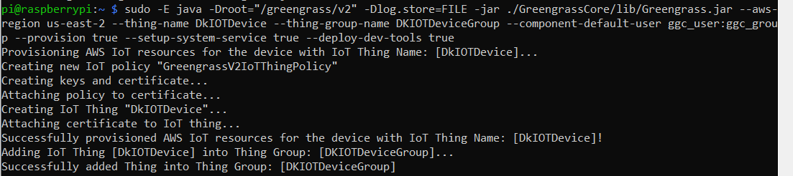
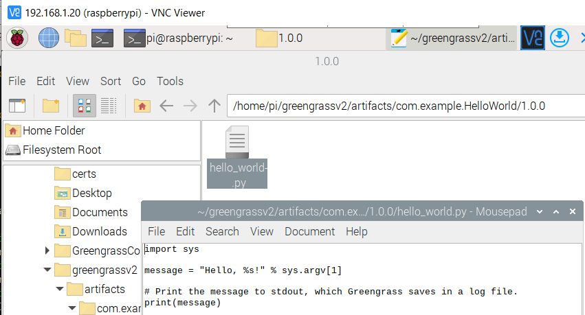
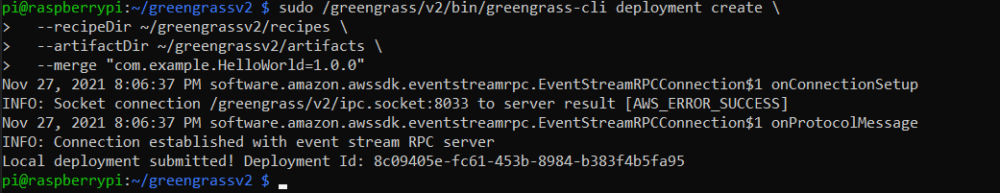

# AWS IoT Greengrass

AWS IOT Greengrass is an edge runtime and cloud service that helps build IOT application on devices. These applications can work on data generated locally, run analysis, create predictions from models, filter & transform data and aggregate information. Allowing such a capability at edge location where data is generated allows developers to build real time applications based on the data. 

It enables devices to collect and analyze data closer to where that data is generated, react autonomously to local events, and communicate securely with other devices on the local network. Greengrass devices can also communicate securely with AWS IoT Core and export IoT data to the AWS Cloud. 

IOT Greengrass allows usage of prebuilt modules called components that connect the edge device to AWS Cloud Service and third party services.

AWS IOT Greengrass cloud service to deploy and run lambda functions, docker containers on your edge devices.

# Pre-req

1. Login to AWS Console using IAM User
2. Connect to Raspberry PI using VNC Viewer. SSH Enabled on Raspberry PI
3. Python, PIP and AWS CLI needs to be installed on Raspberry PI
4. Create a new IAM User to install Greengrass Core on device. Allow Programmatic access.

# Creating a AWS IOT Greengrass Component

1. Connect to Raspberry PI using SSH

    

2. Install Java (JDK)

        sudo apt install default-jdk

    
    
    

3. Login to AWS IOT Greengrass and click Setup one core device

    

4. Put Device name and IAM Group

    

5. Create an IAM user with permissions to install Greengrass core software

    

6. Run command to configure credentials on Raspberry PI

        export AWS_ACCESS_KEY_ID=<AWS_ACCESS_KEY_ID>
        export AWS_SECRET_ACCESS_KEY=<AWS_SECRET_ACCESS_KEY>

7. Run command to download and install AWS IOT Greengrass Core software on Raspberry PI

        curl -s https://d2s8p88vqu9w66.cloudfront.net/releases/greengrass-nucleus-latest.zip > greengrass-nucleus-latest.zip && unzip greengrass-nucleus-latest.zip -d GreengrassCore
       
        sudo -E java -Droot="/greengrass/v2" -Dlog.store=FILE -jar ./GreengrassCore/lib/Greengrass.jar --aws-region us-east-2 --thing-name DkIOTDevice --thing-group-name DKIOTDeviceGroup --component-default-user ggc_user:ggc_group --provision true --setup-system-service true --deploy-dev-tools true

    

    

    

8. Run command

        aws greengrassv2 list-effective-deployments --core-device-thing-name DkIOTDevice

       

9. Run command to see if greengrass cli is deployed

        /greengrass/v2/bin/greengrass-cli -V

10. Create new component
    
    a. Create new folders - Artifacts and Recipes

            mkdir -p ~/greengrassv2/{recipes,artifacts}
            cd ~/greengrassv2

       

    b. Create recipe file

            nano recipes/com.example.HelloWorld-1.0.0.json
 
            {
                "RecipeFormatVersion": "2020-01-25",
                "ComponentName": "com.example.HelloWorld",
                "ComponentVersion": "1.0.0",
                "ComponentDescription": "My first AWS IoT Greengrass component.",
                "ComponentPublisher": "Amazon",
                "ComponentConfiguration": {
                    "DefaultConfiguration": {
                    "Message": "world"
                    }
                },
                "Manifests": [
                    {
                    "Platform": {
                        "os": "linux"
                    },
                    "Lifecycle": {
                        "Run": "python3 -u {artifacts:path}/hello_world.py \"{configuration:/Message}\""
                    }
                    },
                    {
                    "Platform": {
                        "os": "windows"
                    },
                    "Lifecycle": {
                        "Run": "py -3 -u {artifacts:path}/hello_world.py \"{configuration:/Message}\""
                    }
                    }
                ]
            }

       

    c. Create artifact file

            nano artifacts/com.example.HelloWorld/1.0.0/hello_world.py

            import sys

            message = "Hello, %s!" % sys.argv[1]

            # Print the message to stdout, which Greengrass saves in a log file.
            print(message)

       

    d. Run the following command to deploy the component to the AWS IoT Greengrass core

            sudo /greengrass/v2/bin/greengrass-cli deployment create \
            --recipeDir ~/greengrassv2/recipes \
            --artifactDir ~/greengrassv2/artifacts \
            --merge "com.example.HelloWorld=1.0.0"

       

    e. Check log. Should contain "Hello World!.."

            sudo tail -f /greengrass/v2/logs/com.example.HelloWorld.log

       

    f. Modify file and Save

       

    g. Run command to deploy again

            sudo /greengrass/v2/bin/greengrass-cli deployment create \
            --recipeDir ~/greengrassv2/recipes \
            --artifactDir ~/greengrassv2/artifacts \
            --merge "com.example.HelloWorld=1.0.0"

       

    h. Restart component and check log. Should contain "Hello World! Greetings from Dibyendu.."

            sudo /greengrass/v2/bin/greengrass-cli component restart \
            --names "com.example.HelloWorld"

            sudo tail -f /greengrass/v2/logs/com.example.HelloWorld.log

       
    
11. Update Component Configuration

    a. Create new recipe file

            nano hello-world-config-update.json

            {
                "com.example.HelloWorld": {
                    "MERGE": {
                    "Message": "friend"
                    }
                }
            }

    b. Deploy component with new recipe

            sudo /greengrass/v2/bin/greengrass-cli deployment create \
            --merge "com.example.HelloWorld=1.0.0" \
            --update-config hello-world-config-update.json

       

    c. Check Log for new recipe. Should contain "Hello friend! Greetings from Dibyendu.."

        

12. Delete component from Core device

    a. Run Remove command -
        
        sudo /greengrass/v2/bin/greengrass-cli deployment create --remove="com.example.HelloWorld"

          

    b. Check component list

        sudo /greengrass/v2/bin/greengrass-cli component list

13. Create Component in AWS IOT Greengrass Core Service

    a. Copy the artifacts to AWS S3 bucket

        -- Create Bucket
        aws s3 mb s3://greengrass-component-artifacts-721054497033-us-east-2

        -- Create Policy
        nano component-artifact-policy.json

        {
            "Version": "2012-10-17",
            "Statement": [
                {
                "Effect": "Allow",
                "Action": [
                    "s3:GetObject"
                ],
                "Resource": "arn:aws:s3:::greengrass-component-artifacts-721054497033-us-east-2/*"
                }
            ]
        }

        aws iam create-policy \
        --policy-name MyGreengrassV2ComponentArtifactPolicy \
        --policy-document file://component-artifact-policy.json

        aws iam attach-role-policy \
        --role-name GreengrassV2TokenExchangeRole \
        --policy-arn arn:aws:iam::721054497033:policy/MyGreengrassV2ComponentArtifactPolicy

        aws s3 cp \
        artifacts/com.example.HelloWorld/1.0.0/hello_world.py \
        s3://greengrass-component-artifacts-721054497033-us-east-2/artifacts/com.example.HelloWorld/1.0.0/hello_world.py 

                 

    b. Edit Component recipe. Add Artifacts

        
        "Artifacts": [
            {
                "URI": "s3://greengrass-component-artifacts-721054497033-us-east-2/artifacts/com.example.HelloWorld/1.0.0/hello_world.py"
            }
        ]       
        
    c. Create Component in AWS IOT Greengrass Core Service

        aws greengrassv2 create-component-version --inline-recipe fileb://recipes/com.example.HelloWorld-1.0.0.json

        aws greengrassv2 describe-component --arn "arn:aws:greengrass:us-east-2:721054497033:components:com.example.HelloWorld:versions:1.0.0"
  
               
          

    
14. Deploy Component

    a. Go to AWS IOT Greengrass Core service.

    b. Select component com.example.HelloWorld and click Deploy

       

       

    c. Select Create new deployment and click Next

       

    d. Select Core Device

       

    e. Select Component to deploy

       

    f. Configure Component. Change world to universe

       

    g. Review and Deploy

       

       

    h. Check Deployment

       

    i. Check Log
   
        sudo tail -f /greengrass/v2/logs/com.example.HelloWorld.log

        
